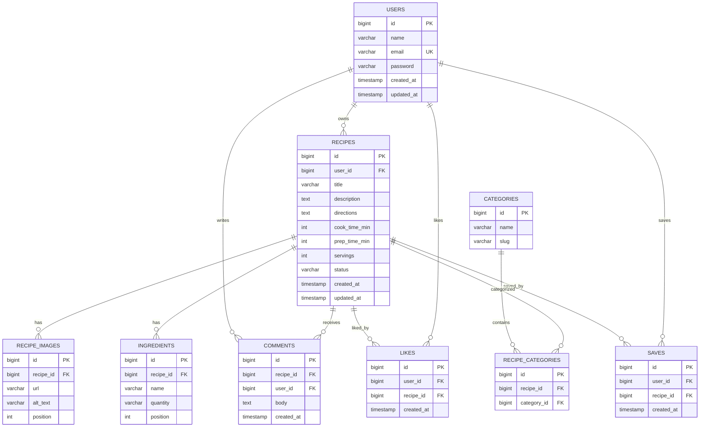

# RecipeHub — Database ER Diagram

## Mermaid ER Diagram

```mermaid
erDiagram
    USERS {
      bigint id PK
      varchar name
      varchar email UK
      varchar password
      timestamp created_at
      timestamp updated_at
    }

    RECIPES {
      bigint id PK
      bigint user_id FK
      varchar title
      text description
      text directions
      int cook_time_min
      int prep_time_min
      int servings
      varchar status
      timestamp created_at
      timestamp updated_at
    }

    CATEGORIES {
      bigint id PK
      varchar name
      varchar slug
    }

    RECIPE_IMAGES {
      bigint id PK
      bigint recipe_id FK
      varchar url
      varchar alt_text
      int position
    }

    INGREDIENTS {
      bigint id PK
      bigint recipe_id FK
      varchar name
      varchar quantity
      int position
    }

    COMMENTS {
      bigint id PK
      bigint recipe_id FK
      bigint user_id FK
      text body
      timestamp created_at
    }

    LIKES {
      bigint id PK
      bigint user_id FK
      bigint recipe_id FK
      timestamp created_at
    }

    SAVES {
      bigint id PK
      bigint user_id FK
      bigint recipe_id FK
      timestamp created_at
    }

    RECIPE_CATEGORIES {
      bigint id PK
      bigint recipe_id FK
      bigint category_id FK
    }

    USERS ||--o{ RECIPES : owns
    RECIPES ||--o{ RECIPE_IMAGES : has
    RECIPES ||--o{ INGREDIENTS : has
    RECIPES ||--o{ COMMENTS : receives
    USERS ||--o{ COMMENTS : writes
    USERS ||--o{ LIKES : likes
    RECIPES ||--o{ LIKES : liked_by
    USERS ||--o{ SAVES : saves
    RECIPES ||--o{ SAVES : saved_by
    RECIPES ||--o{ RECIPE_CATEGORIES : categorized
    CATEGORIES ||--o{ RECIPE_CATEGORIES : contains
```
